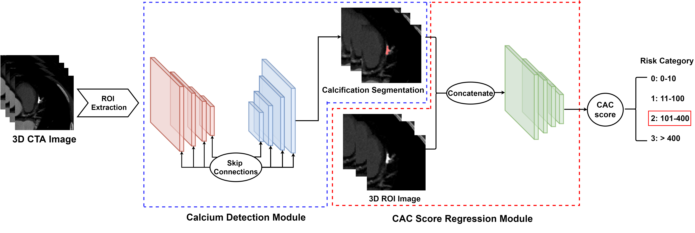
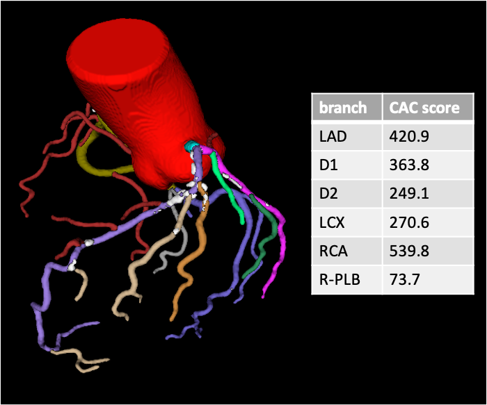

# DL-CTA coronary Agatston calcium scoring
This repository contains the PyTorch implementation of "Automatic Calcium Scoring in Coronary CT Angiography using Deep Learning: Automatically Derived using Spectral CT and Validated using Multiple CTA Imaging Protocols" 



## Setup
### Required packages
- PyTorch 1.7
- SimpleITK
- numpy

## Data Preparation
To train and predict on CTA cases, organize the data according to the following format:
```
data
├── Images
|   ├── case1_iso.nii.gz
|   └── case2_iso.nii.gz
├── Labels
|   ├── case1_cal_seg.nii.gz
|   ├── case1_cal_map.nii.gz
|   ├── case2_cal_seg.nii.gz
|   └── case2_cal_map.nii.gz
├── train_ID_lis.txt
└── val_ID_lis.txt
```
where caseID_cal_seg.nii.gz is the calcification segmentation and  caseID_cal_map.nii.gz is the CAC score distributution according to voxel-wise calcification severity.
## Training 
To train the segmentation model, run:
```
python train_seg.py
```
To train the CAC score regression model, run:
```
python train_regress.py
```
## Testing
To run testing on unseen data, first generate the segmentation results by running:
```
predict_segmentation.py
```
To run the regression model, run:
```
predict_regress.py
```
Note that the segmentation results must be made available before running the regression model. 

## Results:

